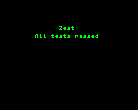
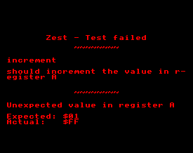

# Zest - Sega Master System/Z80 Test Runner

## What is it?

Zest is a unit test runner for use with the Sega Master System and WLA DX assembler (v10.6+). Utilising the WLA DX macro features, it provides a high-level syntax so you can easily feed routines with fixed inputs and assert their output.

```asm
describe "increment"

it "should increment the value in register A"
    ld a, 0
    call increment      ; call routine
    expect.a.toBe 1     ; assert the result
```

If the above test fails, the tests will stop running and the test description and failure will be printed on the screen.

 

## Quick start

The `template` directory contains a working project with bash and batch build scripts to build the ROM on Linux and Windows respectively. For the scripts to work please ensure `wla-z80` and `wlalink` 10.6+ are in your system path or within the `template` directory.

## Contents

- [Zest - Sega Master System/Z80 Test Runner](#zest---sega-master-systemz80-test-runner)
  - [What is it?](#what-is-it)
  - [Quick start](#quick-start)
  - [Contents](#contents)
  - [Why?](#why)
  - [Examples](#examples)
  - [Assertions](#assertions)
    - [Registers](#registers)
    - [Flags](#flags)
    - [Stack](#stack)
    - [Clobber detection](#clobber-detection)
    - [Mock assertions](#mock-assertions)
    - [zest.fail](#zestfail)
  - [Mocking/stubbing labels](#mockingstubbing-labels)
    - [Mocking macros](#mocking-macros)
  - [Mocking controller input](#mocking-controller-input)
  - [Timeout detection](#timeout-detection)
  - [Memory overwrite detection](#memory-overwrite-detection)
  - [Hooks](#hooks)
    - [zest.preSuite](#zestpresuite)
    - [zest.preTest](#zestpretest)
    - [zest.postTest](#zestposttest)
  - [Paging](#paging)
    - [zest.setBank](#zestsetbank)

## Why?

Pinpointing bugs in assembly code can require lots of manual effort to recreate certain scenarios and ensure everything is working, reducing your confidence for making changes and optimisations to your code.

Instead, with a test runner you can define the list of behaviours you intend a routine to have and ensure they pass, then feel confident to change and optimise the code while being informed if you accidentally break anything.

## Examples

Examples are included in the repo (see `/examples`). You can build these in Linux/WSL using `./examples/build.sh`. The ROM will be placed in `./examples/dist` which you can then run in an emulator or on an actual system.

Create a blank test suite asm file that will serve as the entry point. In this file, use .include to pull in the Zest library and the code files you want to test.

```asm
; Include Zest library
.incdir "../zest"           ; point to zest directory
    .include "zest.asm"     ; include the zest.asm library
.incdir "."                 ; return to current directory

; Include the code you want to test
.include "increment.asm"

; Append your test files to zest.suite
.section "suite" appendto zest.suite
    .include "increment.test.asm"
.ends
```

Within the test file (`increment.test.asm`), the 'describe' and 'it' macros let you define the unit being tested and what behaviours it should exhibit:

```asm
describe "increment"

it "should increment the value in A"
    ld a, 0
    call increment
    expect.a.toBe 1

it "should not increment past 255"
    ld a, 255
    call increment
    expect.a.toBe 255
```

If a test fails, the message will be printed on the screen with details of the test and assertion that failed.

You can also use `test` as an alias for `it` if you prefer:

```asm
describe "math"

test "add"
    ...

test "subtract"
    ...
```

## Assertions

Zest comes with the following assertions out of the box.

### Registers

Example usage:

- `expect.a.toBe 255`
- `expect.b.toBe -128`
- `expect.a.toBe 1 "Custom assertion failure message"`

```asm
expect.a.toBe -128
expect.b.toBe 255
expect.c.toBe 255
expect.d.toBe 255
expect.e.toBe 255
expect.h.toBe 255
expect.l.toBe 255
expect.i.toBe 255
expect.ixh.toBe 255
expect.ixl.toBe 255
expect.iyh.toBe 255
expect.iyl.toBe 255

expect.bc.toBe -32768
expect.de.toBe someLabel
expect.hl.toBe 65535
expect.ix.toBe 65535
expect.iy.toBe 65535
```

### Flags

```asm
expect.carry.toBe 0
expect.carry.toBe 1

expect.parityOverflow.toBe 0
expect.parityOverflow.toBe 1

expect.sign.toBe 0
expect.sign.toBe 1

expect.zeroFlag.toBe 0
expect.zeroFlag.toBe 1
```

### Stack

Expect the stack to contain x additional items since the start of the test:

```asm
expect.stack.size.toBe 3    ; 3 values (16-bit words)

; With custom message
expect.stack.size.toBe 3 "Expected stack size to still be 3"
```

Expect a position in the stack to contain a given word value. You will need to use this before other assertions as those might affect the values in the stack.

```asm
expect.stack.toContain $1234    ; expect the most recent pushed word to be $1234
expect.stack.toContain $1234 1  ; expect the stack position before to contain $1234

; With custom assertion failure message
expect.stack.toContain $1234 0 "my custom message"
```

### Data

Assert the data at the given address contains the given sequence of bytes.

```asm
expect.address.toContain $C000 $00          ; expect $C000 to contain $00
expect.address.toContain $C001 $01 $02 $03  ; expect sequence from $C001 to contain $01, $02, $03
```

Assert the address in HL points to the expected value

```asm
expect.hl.toPointToByte 100 "optional failure message"  ; expect the byte pointed to by HL to be 100
```

### Clobber detection

Use `zest.initRegisters` to initialise all the register with unique values. You can then assert that they all retain these values with `expect.all.toBeUnclobbered`:

```asm
it "should not clobber any registers"
    zest.initRegisters
    call myRoutine
    expect.all.toBeUnclobbered
```

Often a routine will intend to return values within certain registers, so opt these out of the check by using `expect.all.toBeUnclobberedExcept` and passing the register names:

```asm
zest.initRegisters
call myFunction
expect.all.toBeUnclobberedExcept "a" "b"
```

Acceptable register args are `"a", "f", "b", "c", "d", "e", "h", "l", "ixh", "ixl", "iyh", "iyl", "i", "a'", "f'", "b'", "c'", "d'", "e'", "h'", "l'"`.
Register pairs are also allowed: `"af", "bc", "de", "hl", "af'", "bc'", "de'", "hl'"`

### Mock assertions

See [Mocking/stubbing labels](#mockingstubbing-labels) for more details about mocks.

```asm
expect.mock.toHaveBeenCalled myMock
```

You can use the `zest.mock.getTimesCalled` macro to load A with the number of times a given mock was called.

```asm
zest.mock.getTimesCalled myMock
expect.a.toBe 2
```

### zest.fail

Use the `zest.fail` macro to fail a test with an optional message if the program reaches that point.

```
zest.fail ; fails with a default message
zest.fail "Did not expect this piece of code to run"
```

## Mocking/stubbing labels

Sometimes when testing a routine it's necessary or preferable to mock/stub out some of the routines it calls. The mocked routine can assert it's been called with the expected register values, and you can craft it to have a fixed effect of your choosing (loading registers with fixed values, or setting values to RAM etc.).

To do this you first need to separate these labels and routines into separate files, and ensure these files aren't imported into your test suite. This would then free up these labels so you can define you own versions in the test suite. When the code runs it will then utilise your fake versions rather than the real ones.

Zest provides a 'Mock' API that lets you define fake routines in RAM so that you can define different behaviour for different test scenarios. In your test suite you can define your mocks in `ramsection`s using `appendto zest.mocks`:

```asm
.ramsection "my mock instances" appendto zest.mocks
    ; `call someLabel` will call this
    someLabel instanceof zest.Mock
.ends
```

Mocks get reset at the start of each test with a default handler that will simply return (`ret`) to the caller. To override this in a given test, wrap some code in `zest.mock.start` and `zest.mock.end`:

```asm
; Define a custom handler for this mocked label
zest.mock.start someLabel
    ld a, 123
    ; ret is added automatically
zest.mock.end

ld a, 0
call someLabel      ; this will call our handler
expect.a.toBe 123   ; this will pass
```

With the above, when we call `someLabel`, we actually call the code defined between `zest.mock.start` and `zest.mock.end`. Another test can implement its own behaviour for this same label so you can therefore test different scenarios.

### Mocking macros

The principals of mocking macros is the same in that you'd need to ensure you don't import the real macro and instead create a fake version with the same name. To plug this into the mock API you could just make the fake macro call one of the mocks:

```asm
.ramsection "my mock instances" appendto zest.mocks
    myMock instanceof zest.Mock
.ends

.macro "myMacro"
    call myMock
.endm
```

## Mocking controller input

For code that relies on user input, you'll want to be able to mock out the controller ports to return set values such as up, button 1 etc. You could use mocks to mock out your user input handling routines completely, but if you'd rather include this input handling in the test coverage, Zest provides some macros to fake the raw input values at the port level.

It isn't possible to mock out the ports directly, so you'll need to decouple your code from the `in a, (port)` instruction and put this in a macro instead, such as:

```asm
.macro "readPort" args portNumber
    in a, (portNumber)
.endm
```

Place this in a separate file and don't import it in your test suite. Instead, define a fake version with the same name that loads register A with a fake value. You can use `zest.loadFakePortDC` and/or `zest.loadFakePortDD` to load fake input values, which we'll set later. `zest.loadFakePortDD` is only needed if you need to mock controller 2:

```asm
.macro "readPort" args portNumber
    .if portNumber == $dc
        zest.loadFakePortDC
    .elif portNumber == $dd
        zest.loadFakePortDD
    .endif
.endm
```

To set the values these return, you can use `zest.mockController1` and `zest.mockController2` in your tests, and provide one or more buttons you wish to simulate as being pressed.

```asm
zest.mockController1 zest.UP
zest.mockController2 zest.DOWN
```

Input button arguments you can pass to these macros are:

```asm
zest.UP
zest.DOWN
zest.LEFT
zest.RIGHT
zest.BUTTON_1
zest.BUTTON_2
zest.NO_INPUT
```

OR these together with `|` to simulate multiple buttons being pressed:

```asm
; Down and button 1 pressed
zest.mockController2 zest.DOWN|zest.BUTTON_1
```

These mock controller values are reset at the start of each test.

## Timeout detection

By default, Zest will timeout and fail a test if it takes more than 10 full frames/VBlanks to complete, in case the code has got itself into an infinite loop, forgotten to return, or jumped to an invalid location. It does this by decrementing a counter at each VBlank and timing out when it reaches zero. Note: this timeout detection relies on the code not disabling interrupts.

As the test won't necessarily begin at the start of a full frame, an additional frame is added to this number to represent the current partial frame.

The default timeout can be overridden for all tests by defining the `zest.defaultTimeout` value before importing Zest.

```asm
; Timeout tests if they take more than 1 full frame
.define zest.defaultTimeout 1

.incdir "../zest"
    .include "zest.asm"
.incdir "."
```

To override this default timeout for individual tests, use `zest.setTimeout` within the test. You could use this to increase the timeout for tests you expect to take a longer amount of time:

```asm
it "should not timeout"
    ; Only timeout this test if it takes more than 20 full frames
    zest.setTimeout 20
    call mySlowRoutine
```

## Memory overwrite detection

Zest will attempt to detect if its RAM state has been overwritten by a test, and if so will stop the program with an error message. A backup of the test description pointers is kept in VRAM (within the sprite attribute table gap) and Zest will attempt to restore these so it can recover and display the test that exhibits the issue.

## Hooks

You can append to the following sections to hook custom code into the test lifecycle:

### zest.preSuite

Runs at the start of the suite.

```asm
.section "myPreSuiteHook" appendto zest.preSuite
    ; some code
.ends
```

### zest.preTest

Runs at the start of each test.

```asm
.section "myPreTestHook" appendto zest.preTest
    ; some code
.ends
```

### zest.postTest

Runs at the end of each test.

```asm
.section "myPostTestHook" appendto zest.postTest
    ; some code
.ends
```

## Paging

The suite ROM bank is 16KB but if you use this all you can split your tests across multiple banks. To enable this, define a numeric `zest.SUITE_BANKS` value before importing the library. This defaults to 1.

```asm
.define zest.SUITE_BANKS 3  ; enable 3x16KB test suite banks
```

Append your tests to `zest.suite` (bank 1), `zest.suiteBank2`, `zest.suiteBank3` etc.

```asm
.section "tests in bank 1" appendto zest.suite
    ...
.ends

.section "tests in bank 2" appendto zest.suiteBank2
    ...
.ends

.section "tests in bank 3" appendto zest.suiteBank3
    ...
.ends
```

### zest.setBank

Any `free` sections you `.include` are placed in bank 0 by default and are accessible by all the tests. If this bank runs out of space you can use `zest.setBank` to place the code in the additional banks. You should ensure they are in the same bank as the tests that require them.

```asm
.include "a.asm"    ; bank 0 (default)- accessible by all tests

zest.setBank 1
.include "one.asm"  ; bank 1 - accessible by tests in zest.suite

zest.setBank 2
.include "two.asm"  ; bank 2 - accessible by tests in zest.suiteBank2
```
